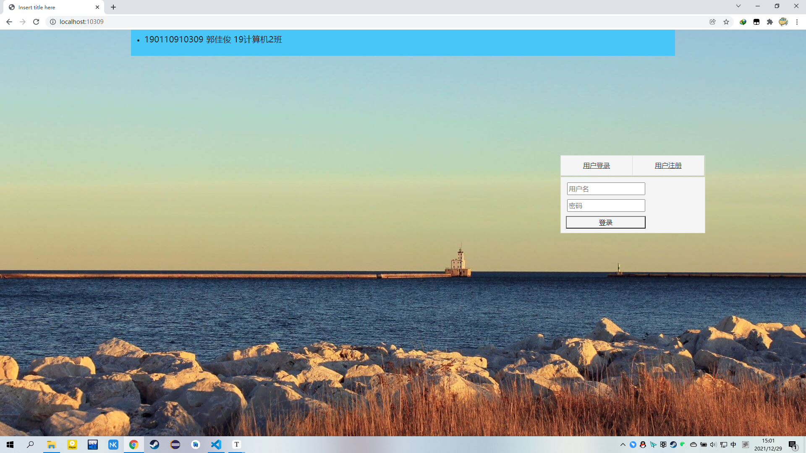
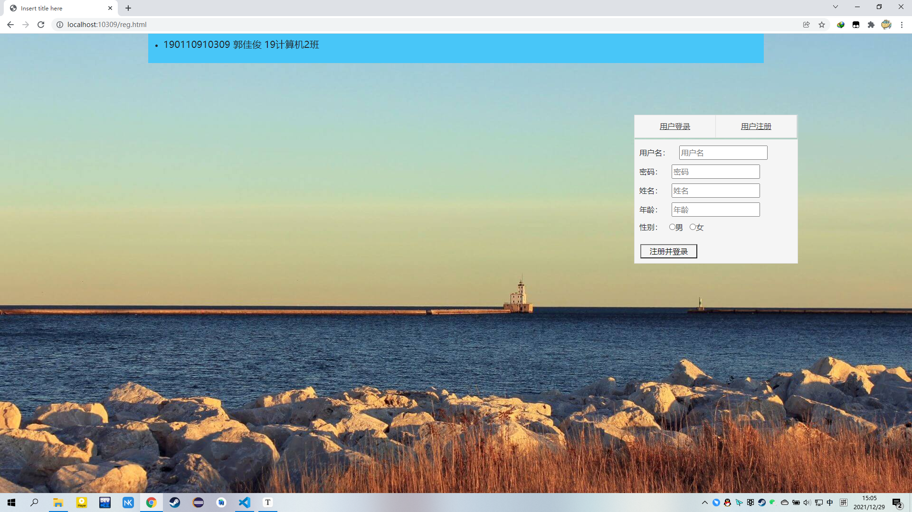
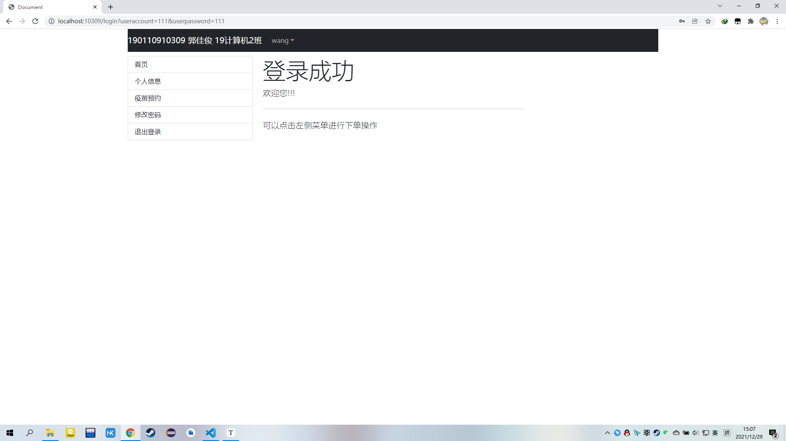
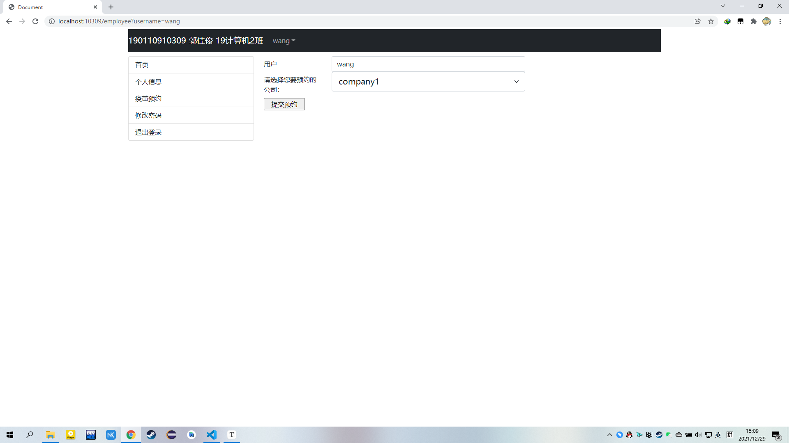
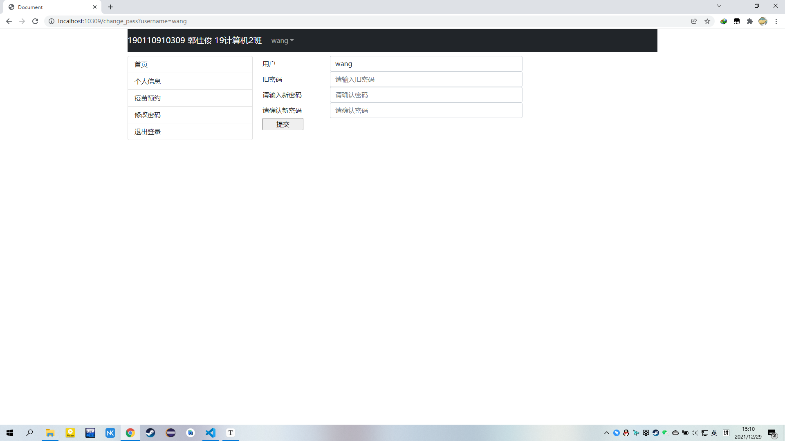
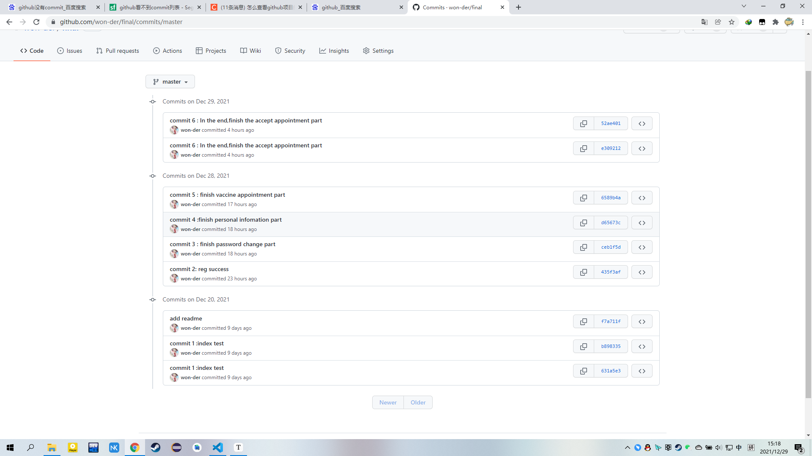

# final

### 1.项目设计

1）项目构成：

​	本项目是一个疫苗预约程序，由project.js的nodejs脚本文件为后端程序，views文件夹中的一组html文件为前端页面，以及photo文件夹中的各类图片资源构成。整个项目运用了github远程仓库进行管理。

2）引入的包：

​	express包，Express 是一个保持最小规模的灵活的 Node.js Web 应用程序开发框架，为 Web 和移动应用程序提供一组强大的功能，开发web应用更加方便，更加快捷。

​	mongoose包，Mongoose为模型提供了一种直接的，基于scheme结构去定义你的数据模型。它内置数据验证， 查询构建，业务逻辑钩子等，使得对于mongodb的处理更加方便快捷。

​	jquery包，jQuery 是一个 JavaScript 函数库，一个轻量级的"写的少，做的多"的 JavaScript 库。

3）项目目录结构

​	项目根目录中的文件有，project.js是用于整个项目的后端程序，README.md是项目说明书，test_DB_data.mongodb是一个用于快速重置mongdb数据库的playground，以及license和项目信息的json文件。

​	views文件夹中存放着项目所需要的前端html文件。包括index.html是项目的初始界面包含着用户登录功能，reg.html用于处理新用户注册功能，frontpage.html是用户登录后跳转的页面，如果是管理员登录则会跳转至employer页面用于管理员管理用户的预约请求。personal.html是用于显示用户的个人信息页面，employee.htm是用户提交预约申请的页面，还有change_pass.html是用户用于修改密码的界面。

​	photo文件夹中存放着网页中需要的图片文件，包括背景图片等。

​	node_modules文件夹中存放着js文件中需要引入的包。

### 2.使用说明

1.用户登录,用户可以通过已有账户登录，若没有，则可以点击用户注册按钮进行注册操作

2.用户注册，用户可以填入自身的相关信息进行新用户的注册，其中用户名和账号不能与已存在的账号相同，否则会返回报警提示

3.登录成功，后可以通过左侧选择栏选择要进行的操作

4.个人信息页面,用户可以查看自己的个人信息

5.疫苗预约界面,用户可以提交疫苗预约请求,选择自己想要预约的疫苗公司,若已经申请后,就不能再次申请.

6.修改密码,用户可以通过输入旧密码和新密码并确认新密码后修改账户密码

### 3.开发日志

